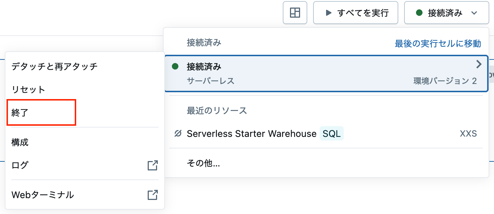

# Databricks Free Editionチュートリアル

**前提:** Databricks Free Editionアカウント作成済み
- まだの方は[こちら](https://qiita.com/taka_yayoi/items/33e9cfa7ca9ca9febe72)を参考にサインアップお願いします。

## 0. My first Databricks

Databricksの基本的な使い方を説明します。

## 1. Unity Catalog

Unity Catalogのコンセプト、基本的な使い方を学びます。

## 2. PySpark transformation

PySparkを用いたデータ変換処理を体験します。

## 3. ML Tutorial

scikit-learnを使ったモデルの構築、管理を学びます。

## 注意事項

- 複数のノートブックから右上の「接続」からサーバレスに接続した際、2つ目のノートブックの実行時に**Max Retried Error**が発生する場合があります。
- これはサーバレスの計算資源の制限によるものです。
- 2つ目のノートブックを実行する際に、1つ目のノートブックの右上の**接続済み→接続済み(サーバレス)→終了**をクリックして1つ目のノートブックの接続を切断
してください。

- その後数分待ってから2つ目のノートブックを実行してください。
